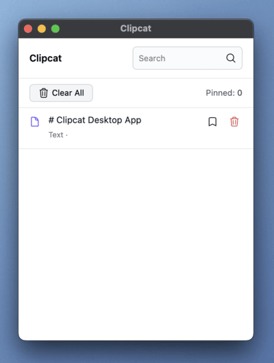

# Clipcat Desktop App

Clipcat is a lightweight, efficient, and open-source clipboard manager built with a powerful combination of Rust, Tauri, and React. It runs in the background, keeps a history of what you copy, and makes it easy to find and reuse your clips.



---

## ✨ Features

- **Clipboard History**: Automatically tracks and saves text and images copied to your clipboard.
- **Persistent Pinning**: Pin frequently used clips to keep them accessible. Pinned items are saved even after restarting the app.
- **Text & Image Support**: Seamlessly handles both text snippets and image data.
- **Efficient Search**: Quickly find any clip in your history. _(Backend support is implemented)_
- **Duplicate Detection**: Avoids clutter by intelligently preventing duplicate entries for texts.
- **One-Click Copy**: Copy any item from your history back to the clipboard with a single click.
- **Clean & Simple UI**: An intuitive interface built with React and Tailwind CSS for a smooth user experience.
- **Cross-Platform**: Built with Tauri to run on Windows, macOS, and Linux.
- **Resource-Efficient**: The Rust backend ensures low memory and CPU usage.

## 🛠️ Tech Stack

- **Backend & Core**: [Rust](https://www.rust-lang.org/)
- **Desktop Framework**: [Tauri](https://tauri.app/)
- **Frontend**: [React](https://reactjs.org/), [TypeScript](https://www.typescriptlang.org/)
- **Styling**: [Tailwind CSS](https://tailwindcss.com/)
- **Bundler**: [Vite](https://vitejs.dev/)

## 🚀 Getting Started

To run Clipcat on your local machine, follow these steps.

### Prerequisites

- [Node.js](https://nodejs.org/)
- [Rust](https://www.rust-lang.org/tools/install)
- [Tauri Prerequisites](https://tauri.app/v1/guides/getting-started/prerequisites) for your specific operating system.

### Installation & Development

1.  **Clone the repository:**

    ```sh
    git clone https://github.com/EArnold1/clipcat_desktop.git
    cd clipcat_app
    ```

2.  **Install frontend dependencies:**

    ```sh
    cd src
    npm install
    ```

3.  **Run the development server:**
    This command will launch the application in a development window with hot-reloading for both the frontend and backend.
    ```sh
    cd ..
    cargo tauri dev
    ```
